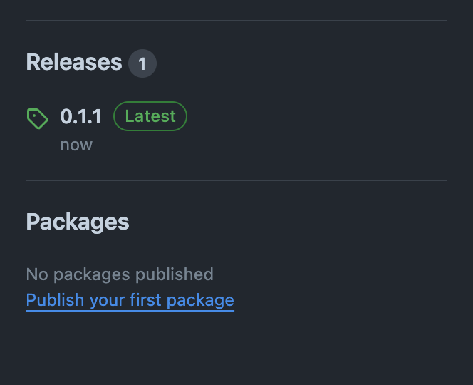
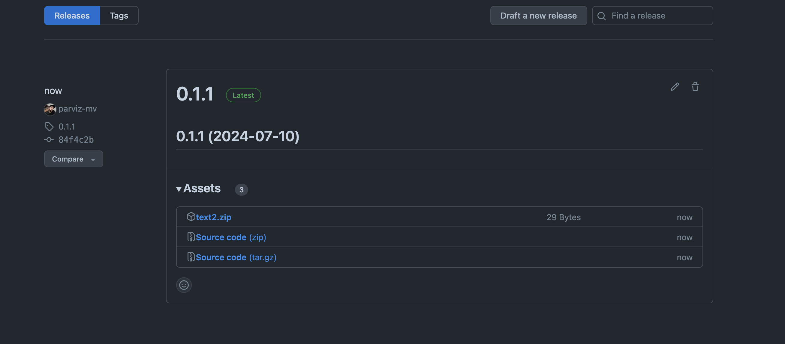

# Example of usage `release-it` lib

The `release-it` lib is a tool that automates the release process for your project. It can be used to automate the release process for your project, including versioning, changelog generation, and publishing to various platforms.

This example shows how to use the `release-it` lib with a config file. The config file is a JSON file that contains the configuration for the `release-it` lib.

## Usage

1. Clone this repo:

```bash
git clone https://github.com/parviz-mv/release-it-example.git
```

2. Install dependencies:

```bash
npm install
```

3. Create a `.env` file and add your github token:

```bash
GITHUB_TOKEN=your-github-token
```

4. Add packed(zip or tgz) files to the `dist` folder. The packed files will be publish in the release of github.

**NOTE:** Create a `dist` folder in root of project if not exist. The packed files should be in the `dist` folder.

5. Run the release-it command by running :

```bash
npm run release-it
or
npx release-it
```

You will see the release process in the console. Then you can see the release in github:



Result with files:


